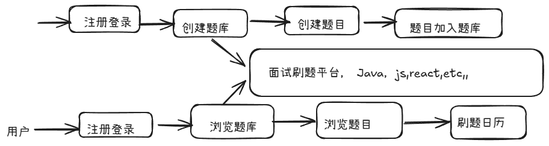
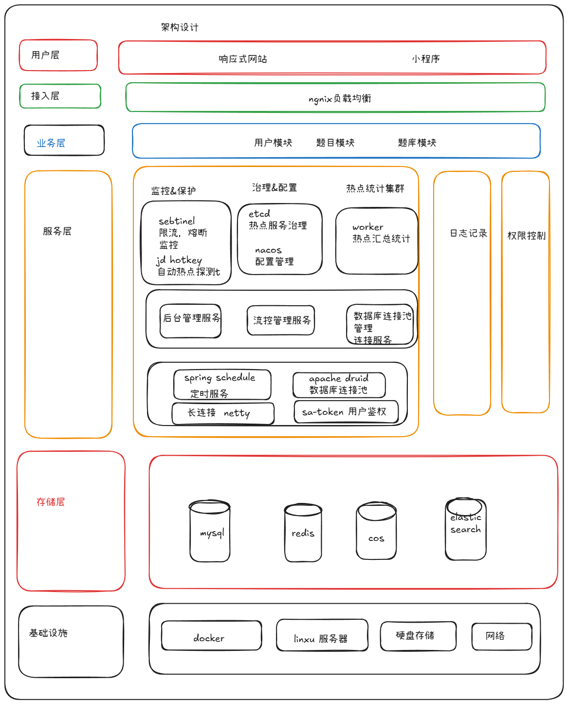

# 一.核心开发流程

# 二.项目功能梳理

## 基础功能

1. 用户
    1. --用户注册
    2. --用户登录
    3. --管理员
2. 题库
    1. -- 查看题库列表
        1. ---查看题目详情
        2. --管理员  管理题库，增删改查
3. 题目
    1. ---题目搜索
        1. ---查看题目详情
            1. ----管理员管理题目，比如按照题库查询题目，修改题目属于的题库，etc
4. 高级功能
    5. 题目批量管理
        1. ---管理员  批量向题库添加题目
        2. ----管理员 批量从题库移除题目
        3. ---- 管理员 批量从题库删除题目
6. 分词题目检索
7. 用户刷题记录日历图
8. 自动缓存热门题目
9. 网站流量控制和熔断
10. 动态ip黑白名单过滤
11. 同端登录冲突检测
12. 分级题目反爬虫策略

# 三.  技术选型

## 前端
- [ ] react
- [ ] nextjs服务端渲染
- [ ] redux状态管理
- [ ] ant design 组件库
- [ ] 富文本编辑器组件
- [ ] 前端工程化
- [ ] eslint+prettier+typescripts
- [ ] openai 前端代码生成
- [ ] 后端
- [ ] java sprintboot +maven多模块构建
- [ ] mysql+mybatis-plus+my batis x
- [ ] redis 分布式缓存 + caffine本地缓存
- [ ] redission分布式锁+bitmap+bloomfilter
- [ ] elastsearch 本地搜索引擎
- [ ] druid 数据库连接池
- [ ] sa-token 权限控制
- [ ] hotkey 热点探测
- [ ] sentinel 流量控制
- [ ] nacos 配置中心
- [ ] 多角度项目优化： 性能，安全性，可用性
# 四.核心架构图

# 五.环境准备
## jdk 版本要求8，11，17
## 推荐11，caffeine要求11
## nodejs>18.8

