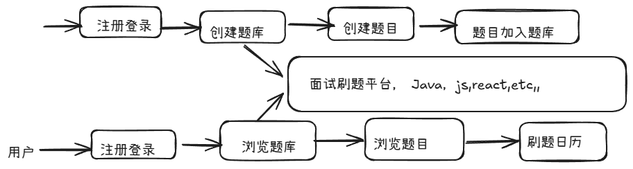
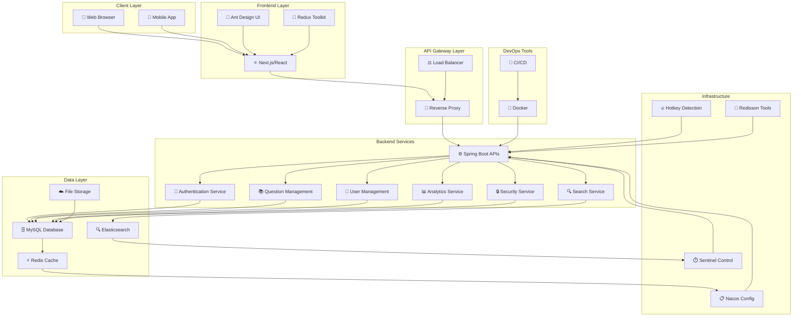
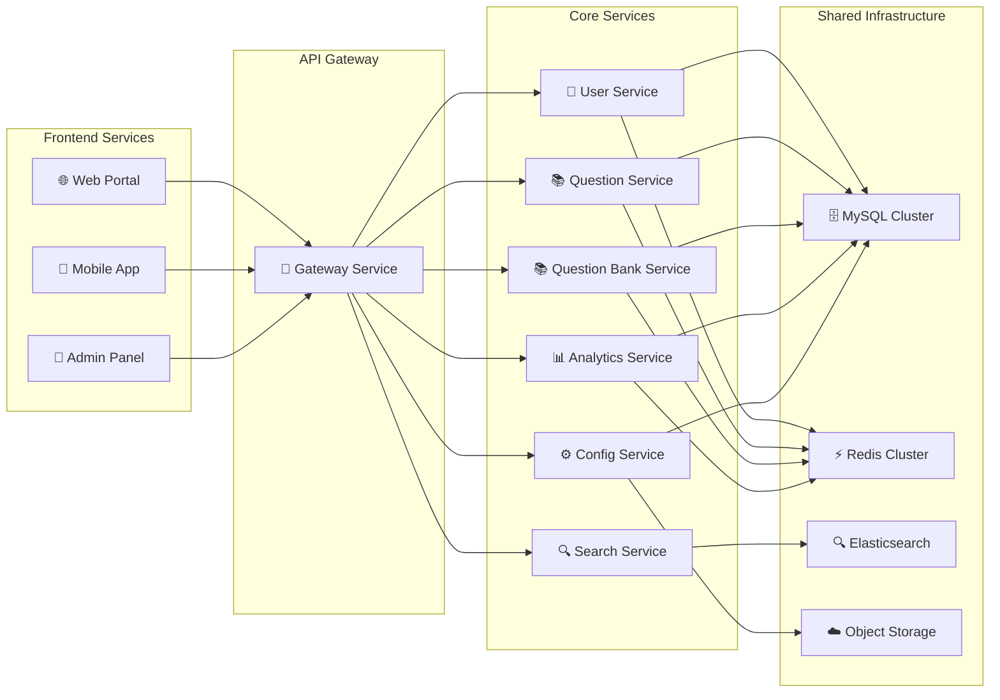

# 一.核心开发流程

[![zread](https://img.shields.io/badge/Ask_Zread-_.svg?style=flat&color=00b0aa&labelColor=000000&logo=data%3Aimage%2Fsvg%2Bxml%3Bbase64%2CPHN2ZyB3aWR0aD0iMTYiIGhlaWdodD0iMTYiIHZpZXdCb3g9IjAgMCAxNiAxNiIgZmlsbD0ibm9uZSIgeG1sbnM9Imh0dHA6Ly93d3cudzMub3JnLzIwMDAvc3ZnIj4KPHBhdGggZD0iTTQuOTYxNTYgMS42MDAxSDIuMjQxNTZDMS44ODgxIDEuNjAwMSAxLjYwMTU2IDEuODg2NjQgMS42MDE1NiAyLjI0MDFWNC45NjAxQzEuNjAxNTYgNS4zMTM1NiAxLjg4ODEgNS42MDAxIDIuMjQxNTYgNS42MDAxSDQuOTYxNTZDNS4zMTUwMiA1LjYwMDEgNS42MDE1NiA1LjMxMzU2IDUuNjAxNTYgNC45NjAxVjIuMjQwMUM1LjYwMTU2IDEuODg2NjQgNS4zMTUwMiAxLjYwMDEgNC45NjE1NiAxLjYwMDFaIiBmaWxsPSIjZmZmIi8%2BCjxwYXRoIGQ9Ik00Ljk2MTU2IDEwLjM5OTlIMi4yNDE1NkMxLjg4ODEgMTAuMzk5OSAxLjYwMTU2IDEwLjY4NjQgMS42MDE1NiAxMS4wMzk5VjEzLjc1OTlDMS42MDE1NiAxNC4xMTM0IDEuODg4MSAxNC4zOTk5IDIuMjQxNTYgMTQuMzk5OUg0Ljk2MTU2QzUuMzE1MDIgMTQuMzk5OSA1LjYwMTU2IDE0LjExMzQgNS42MDE1NiAxMy43NTk5VjExLjAzOTlDNS42MDE1NiAxMC42ODY0IDUuMzE1MDIgMTAuMzk5OSA0Ljk2MTU2IDEwLjM5OTlaIiBmaWxsPSIjZmZmIi8%2BCjxwYXRoIGQ9Ik0xMy43NTg0IDEuNjAwMUgxMS4wMzg0QzEwLjY4NSAxLjYwMDEgMTAuMzk4NCAxLjg4NjY0IDEwLjM5ODQgMi4yNDAxVjQuOTYwMUMxMC4zOTg0IDUuMzEzNTYgMTAuNjg1IDUuNjAwMSAxMS4wMzg0IDUuNjAwMUgxMy43NTg0QzE0LjExMTkgNS42MDAxIDE0LjM5ODQgNS4zMTM1NiAxNC4zOTg0IDQuOTYwMVYyLjI0MDFDMTQuMzk4NCAxLjg4NjY0IDE0LjExMTkgMS42MDAxIDEzLjc1ODQgMS42MDAxWiIgZmlsbD0iI2ZmZiIvPgo8cGF0aCBkPSJNNCAxMkwxMiA0TDQgMTJaIiBmaWxsPSIjZmZmIi8%2BCjxwYXRoIGQ9Ik00IDEyTDEyIDQiIHN0cm9rZT0iI2ZmZiIgc3Ryb2tlLXdpZHRoPSIxLjUiIHN0cm9rZS1saW5lY2FwPSJyb3VuZCIvPgo8L3N2Zz4K&logoColor=ffffff)](https://zread.ai/lora-sys/mianshiya-next-lora)

# 二.项目功能梳理

## 基础功能

1. 用户
    1. --用户注册
    2. --用户登录
    3. --管理员
2. 题库
    1. -- 查看题库列表
        1. ---查看题目详情
        2. --管理员  管理题库，增删改查
3. 题目
    1. ---题目搜索
        1. ---查看题目详情
            1. ----管理员管理题目，比如按照题库查询题目，修改题目属于的题库，etc
4. 高级功能
    5. 题目批量管理
        1. ---管理员  批量向题库添加题目
        2. ----管理员 批量从题库移除题目
        3. ---- 管理员 批量从题库删除题目
6. 分词题目检索
7. 用户刷题记录日历图
8. 自动缓存热门题目
9. 网站流量控制和熔断
10. 动态ip黑白名单过滤
11. 同端登录冲突检测
12. 分级题目反爬虫策略

# 三.  技术选型

## 前端
- [ ] react
- [ ] nextjs服务端渲染
- [ ] redux状态管理
- [ ] ant design 组件库
- [ ] 富文本编辑器组件
- [ ] 前端工程化
- [ ] eslint+prettier+typescripts
- [ ] openai 前端代码生成
- [ ] 后端
- [ ] java sprintboot +maven多模块构建
- [ ] mysql+mybatis-plus+my batis x
- [ ] redis 分布式缓存 + caffine本地缓存
- [ ] redission分布式锁+bitmap+bloomfilter
- [ ] elastsearch 本地搜索引擎
- [ ] druid 数据库连接池
- [ ] sa-token 权限控制
- [ ] hotkey 热点探测
- [ ] sentinel 流量控制
- [ ] nacos 配置中心
- [ ] 多角度项目优化： 性能，安全性，可用性
# 四.核心架构图

## 4.1 系统整体架构

## 4.2 微服务架构图

## 4.3 技术栈架构

### 🎨 前端技术栈
- **框架**: Next.js + React
- **UI库**: Ant Design
- **状态管理**: Redux Toolkit
- **富文本**: Bytemd
- **图表**: ECharts for React
- **可视化**: React Flow
- **开发工具**: TypeScript, ESLint, Prettier

### ⚙️ 后端技术栈
- **框架**: Spring Boot 2.7.2
- **语言**: Java 11
- **数据库**: MySQL + MyBatis-Plus
- **缓存**: Redis + Caffeine + Redisson
- **搜索引擎**: Elasticsearch
- **权限**: Sa-Token
- **配置中心**: Nacos
- **流量控制**: Sentinel
- **连接池**: Druid
- **监控文档**: Knife4j

### 🚀 部署与运维
- **容器化**: Docker
- **分词检索**: Elasticsearch
- **热点探测**: Hotkey
- **微信集成**: WeChat SDK
- **文件存储**: Tencent Cloud COS
- **部署**: CI/CD Pipeline

# 五.环境准备
## jdk 版本要求8，11，17
## 推荐11，caffeine要求11
## nodejs>18.8

